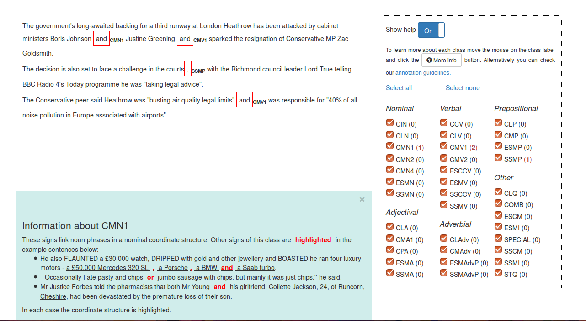

# Introduction

This is the web interface for the Sign Tagger developed in 
[the FIRST project](http://first-asd.eu). The interface makes use of the machine
learning based [Sign Tagger](https://github.com/dinel/SignTagger) and allows users
to easily visualise signs of syntactic complexity in texts. The interface should
be quite straightforward to use. A screenshot is presented below.

# Demo

You can try the system at [http://rgcl.wlv.ac.uk/demos/SignTaggerWebDemo/](http://rgcl.wlv.ac.uk/demos/SignTaggerWebDemo/)

# Screenshot

 

# Contact

For bugs and feature requests please 
[submit an issue](https://github.com/dinel/SignTaggerWebDemo/issues). You can
always contact me by email on <dinel@dinel.org.uk>.